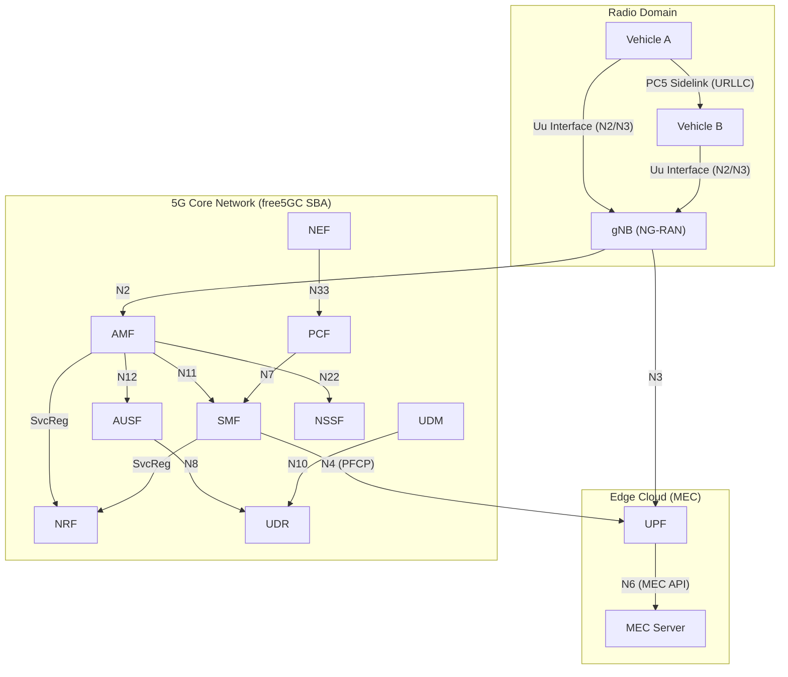

# URLLC-Topologies
some URLLC Topologies made with mermaid in order to be implemented in Free5GC

   

# 1- URLLC for for vehicle-to-vehicle accident avoidance

```mermaid
flowchart TB
  %% Radio Domain
  subgraph "Radio Domain"
    direction TB
    V1[Vehicle A]
    V2[Vehicle B]
    gNB["gNB (NG‑RAN)"]
    V1 -- "PC5 Sidelink (URLLC)" --> V2
    V1 -- "Uu Interface (N2/N3)" --> gNB
    V2 -- "Uu Interface (N2/N3)" --> gNB
  end

  %% Edge Cloud
  subgraph "Edge Cloud (MEC)"
    MEC[MEC Server]
    UPF[UPF]
    gNB -- "N3" --> UPF
    UPF -- "N6 (MEC API)" --> MEC
  end

  %% 5G Core Network
  subgraph "5G Core Network (free5GC SBA)"
    direction TB
    AMF[AMF]
    SMF[SMF]
    UPF[UPF]
    NRF[NRF]
    AUSF[AUSF]
    UDM[UDM]
    UDR[UDR]
    PCF[PCF]
    NEF[NEF]
    NSSF[NSSF]

    gNB -- "N2" --> AMF
    AMF -- "N11" --> SMF
    SMF -- "N4 (PFCP)" --> UPF
    AMF -- "SvcReg" --> NRF
    SMF -- "SvcReg" --> NRF
    AMF -- "N12" --> AUSF
    AUSF -- "N8" --> UDR
    UDM -- "N10" --> UDR
    PCF -- "N7" --> SMF
    NEF -- "N33" --> PCF
    AMF -- "N22" --> NSSF
  end

```
